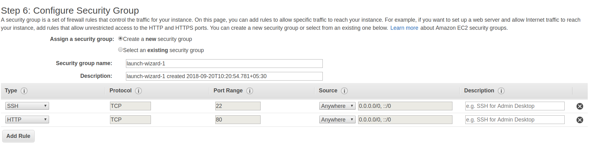
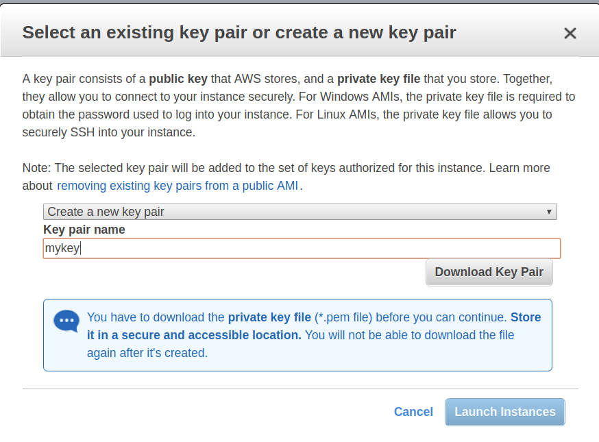
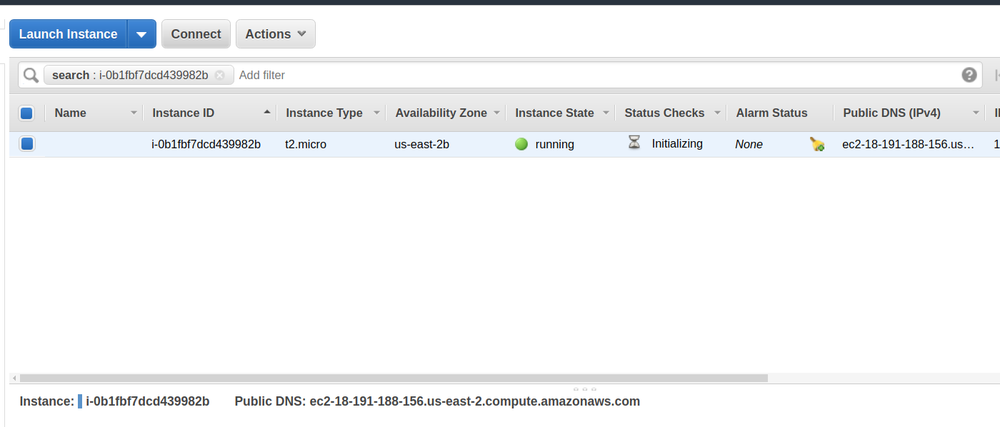
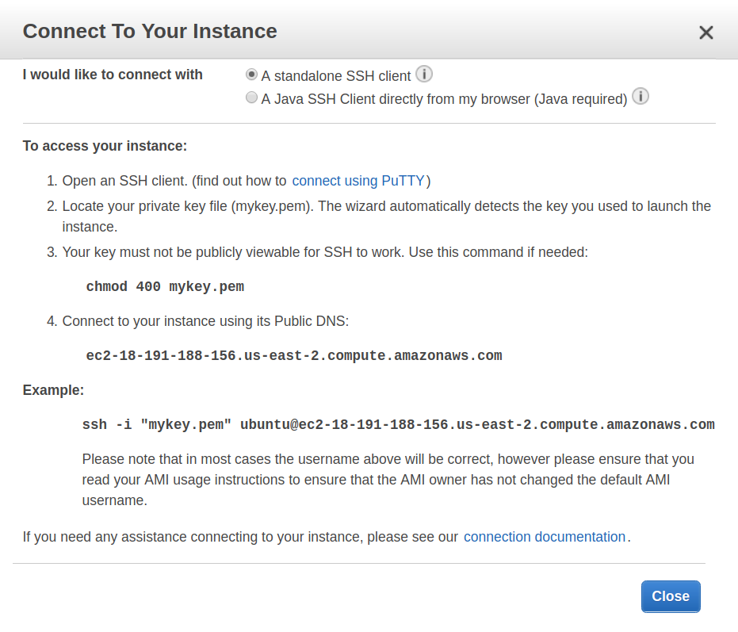

# Amazon Web Services

Deploying Badgeyay to AWS is a 3 phase process

## Phase 1

This phase involves creating the EC2 instance which will hold the app.

* **Step 1** - Go to Amazon Web Services console and select [EC2](https://console.aws.amazon.com/ec2/).

* **Step 2** - Under the 'Create Instance' tab, click on the 'Launch Instance' button. This will take you to the instance creation procedure.

* **Step 3** - Here, select the Ubuntu 16 x64 as the linux distribution. Then click on next. Keep clicking next until you reach *Configuring Security Groups*.

* **Step 4** - Now, in *Configuring Security Groups*, add a new rule to accept all HTTP connection as shown in the screenshot below. Then click on next.



* **Step 5** - Click Launch in this 7th step and you will be presented with a dialog box to choose/create a key. From the drop-down menu, select 'create a key' and give it a name, let's say 'mykey' for instance.
Then download the key. Keep it safe because if you lose it, you will lose access to the server.



* **Step 6** - Once the instance is created, you will be forwarded to the instances list, like in the screenshot below.



Select the newly created instance and then click on the Connect button. You will see a dialog box with instructions on how to connect to it using ssh.



* **Step 7** - Open the terminal in the directory where you have downloaded the key file and then run the command you got from the previous step. For this case, it would look like

```sh
$ chmod 400 mykey.pem
$ ssh -i "mykey.pem" ubuntu@ec2-18-191-188-156.us-east-2.compute.amazonaws.com
```

Type 'yes' when it asks for connection confirmation.

* **Step 8** - Now you will be inside the server's shell. You'd need to install the language pack. So run the following command.

```sh
$ sudo apt-get install language-pack-en
```

## Phase 2

This phase deals with installing Docker and Docker Compose on our cloud Ubuntu instance.

* **Step 1** - The first step is to install Docker and Docker Compose in your cloud Ubuntu instance. For that you can follow [official installion instructions for Ubuntu](https://docs.docker.com/engine/installation/linux/ubuntulinux/).

```sh
$ sudo apt-get update
$ sudo apt-get install \
    apt-transport-https \
    ca-certificates \
    curl \
    software-properties-common
$ curl -fsSL https://download.docker.com/linux/ubuntu/gpg | sudo apt-key add -
$ sudo apt-key fingerprint 0EBFCD88
$ sudo add-apt-repository \
   "deb [arch=amd64] https://download.docker.com/linux/ubuntu \
   $(lsb_release -cs) \
   stable"
$ sudo apt-get update
$ sudo apt-get install docker-ce
```

To verify your Docker installation, type

```sh
$ sudo docker run hello-world
```

* **Step 2** - Finally you will have to add your current group to the `docker` group so that you can run commands without sudo.
([Reference](http://docs.aws.amazon.com/AmazonECS/latest/developerguide/docker-basics.html#install_docker))

```sh
$ sudo usermod -a -G docker $(whoami)
```

* **Step 3** - After this step, you will have to re-login. So to close the connection from the terminal, type `exit` and then connect to it with ssh again.

## Phase 3

The third phase is about building the Badgeyay on the server and running it. The steps here are going to be very similar to the [Badgeyay Docker installation docs](docker.md), so it is highly recommended to have a look at it to get the pith of the process.

* **Step 1** - Firstly, we will set the `SERVER_NAME` config.

```sh
$ export SERVER_NAME="ec2-18-191-188-156.us-east-2.compute.amazonaws.com"
```

* **Step 2** - Clone the Badgeyay repository and `cd` into it.

```sh
$ git clone https://github.com/fossasia/badgeyay.git && cd badgeyay
```

* **Step 3** - Now we need to build the Docker image for Badgeyay

```sh
$ cd api/
$ docker-Compose build
```

* **Step 4** - Then start the server.

```sh
$ docker-compose up
```
* **Step 5** - Now that the server is running we have to create the databases and tables. So open a new terminal on your local system in the same directory where 'mykey' file is stored and connect to the server.

```sh
$ ssh -i "mykey.pem" ubuntu@ec2-18-191-188-156.us-east-2.compute.amazonaws.com
```

*Note -* Here also use the command you got from the Connect step in Phase 1.

* **Step 6** - In the new terminal, run the following command -

```bash
docker-compose run postgres psql -h postgres -p 5432 -U postgres --password
```

Write 'test' as password and press ENTER.

* **Step 7** - When PSQL shell opens, create the database as follows

```sql
create database badgeyay;
```

Then exit the PSQL shell using `\q` and press ENTER.

* **Step 8** - Then visit the public DNS to see your site live. In this it will be
https://ec2-18-191-188-156.us-east-2.compute.amazonaws.com
